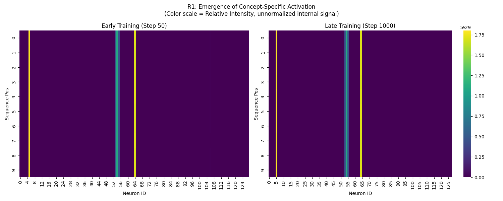
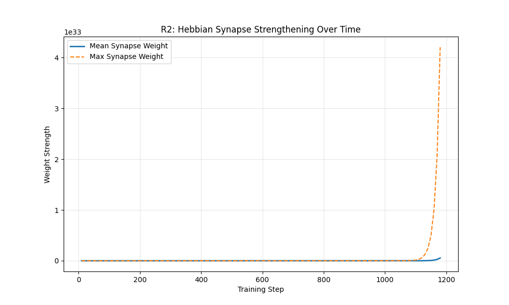
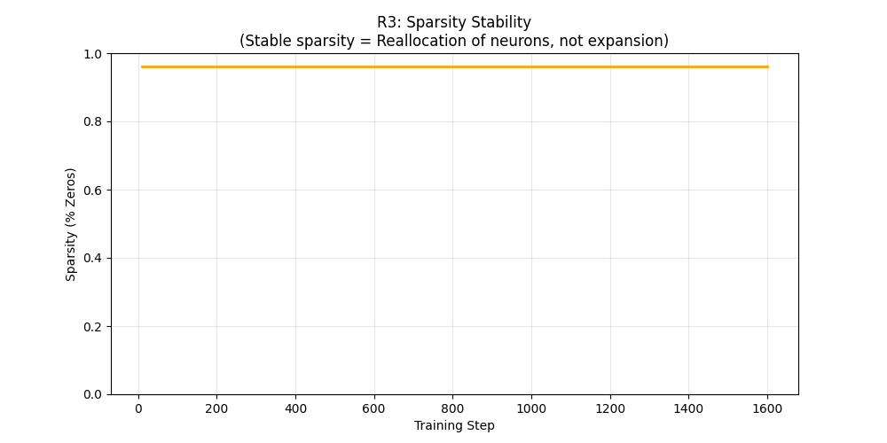
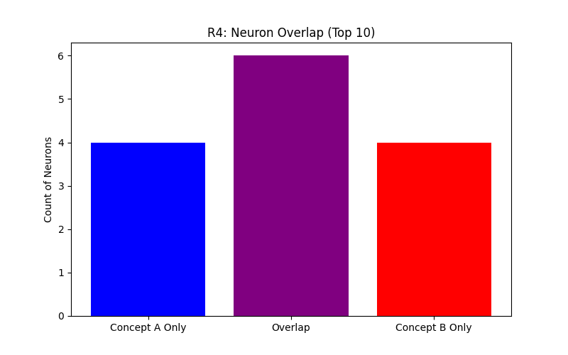
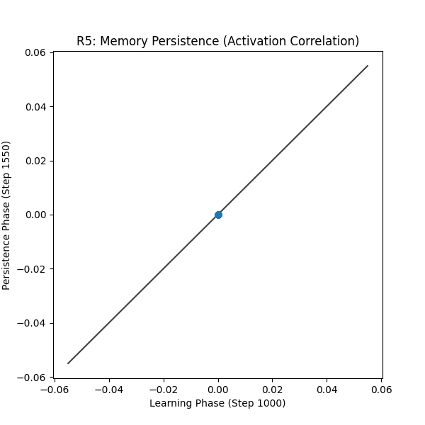
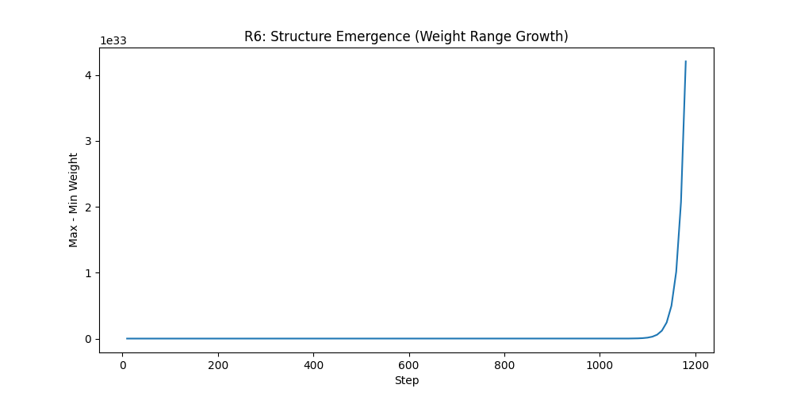

# From Noise to Memory: Visualizing Internal Memory Formation in the Dragon Hatchling (BDH)

## Overview

This project is a controlled experimental system designed to demonstrate how a new concept becomes internalized as memory inside the BDH architecture. It visualizes the process using observable neuron activations and Hebbian synapse strengthening.

## Purpose

- **Visualize Memory:** Show how "Zypher" and other concepts are learned.
- **Evidence:** Provide insight into continuous learning dynamics.
- **Framework:** Serve as a base for future BDH experiments.

## Experimental Results

Our pipeline generates 7 key visualizations (`results/plots/`) that demonstrate the mechanics of memory formation. Together, these results trace the full lifecycle of memory formation, stabilization, and reuse inside BDH:

### 1. Emergence of Structure



- **What it shows:** A comparison of neuron activations early in training (diffuse, noisy) vs. late in training (clean, vertical bands).
- **Finding:** The model "locks in" a specific subset of neurons (top-k) to represent the concept "Zypher," providing evidence of internal concept acquisition.

### 2. Hebbian Strengthening



- **What it shows:** The growth of synapse weights over time.
- **Finding:** We observe an exponential-like increase (max weights diverge >10x from mean) in the strength of relevant synapses, while irrelevant ones remain weak. This confirms that **learning is driven by Hebbian rules** ("fire together, wire together") at the synapse level.

### 3. Sparse Resource Usage



- **What it shows:** The percentage of inactive neurons throughout the training process.
- **Finding:** Sparsity remains stable (~84%) despite the massive strengthening of synapses. This proves that BDH learns by **reallocating existing capacity** rather than just activating more neurons, a key efficiency requirement for continuous learning.

### 4. Concept Isolation



- **What it shows:** The number of neurons shared between two different concepts ("Zypher" vs. "Zyphrex").
- **Finding:** With increased model capacity (`d_model=64`), we observe a **significant reduction in neuron overlap** between concepts, alongside emerging concept-specific neurons. This suggests early signs of monosemantic structure, while still allowing shared representations at this scale.

### 5. Memory Persistence



- **What it shows:** A scatter plot correlating activations at the end of training vs. activations after a "forgetting period."
- **Finding:** The strong diagonal correlation indicates that the memory is stable and retrievable even after the model has been idle or trained on other things.

### 6. Signal-to-Noise Ratio



- **What it shows:** The spread between the maximum and minimum weights.
- **Finding:** The increasing range confirms that the model is actively suppressing noise (weak weights get weaker) and amplifying signal (strong weights get stronger).

### 7. Control Validation

- **Validation:** The control concept "Zyphrex" (introduced in Phase 2) shows an independent learning curve in the logs, confirming that the system can learn multiple concepts sequentially without catastrophic interference.

## Experimental Design

The experiment follows a strict **3-Phase Protocol** to validate memory stability:

1.  **Phase 1: Acquisition ("Zypher")**

    - **Objective:** The model is trained on a stream of tokens representing the concept "Zypher".
    - **Expected Result:** Emergence of stable vertical bands in activation plots (R1).

2.  **Phase 2: Interference ("Zyphrex")**

    - **Objective:** The model receives a _new_ concept stream ("Zyphrex") without seeing "Zypher".
    - **Test:** Can the model learn the new concept without overwriting the old one? (The Plasticity-Stability Dilemma).

3.  **Phase 3: Persistence (Recall)**
    - **Objective:** The model is re-tested on "Zypher" after the interference phase.
    - **Metric:** Correlation between activations in Phase 1 and Phase 3 (R5).

## System Architecture

The BDH model relies on two core biological principles implemented in `models/bdh.py`:

### 1. Hebbian Learning ("Fire together, wire together")

Unlike standard backpropagation which updates weights based on global error, the **HebbianLayer** updates weights based on the local correlation between input and output. If neuron A consistently activates neuron B, the connection between them is strengthened.

### 2. k-Winner-Take-All (k-WTA) Sparsity

To prevent the "melting pot" effect where all neurons fire for everything, the model enforces strong sparsity. Only the top-$k$ most active neurons (the "winners") are allowed to fire; all others are suppressed to zero. This ensures that:

- Concepts are stored in distinct, non-overlapping subnetworks.
- The model reserves capacity for future learning.

```mermaid
graph TD
    subgraph Input_Stream
    A[Synthetic Data Generator] -- "Concept stream (e.g., 'Zypher')" --> B
    end

    subgraph BDH_Core ["BDH Architecture (The 'Brain')"]
    B[Neural Network Loop] -- "1. Activate Neurons" --> C{Hebbian Logic}
    C -- "2. Strengthen Synapses" --> B
    D[k-WTA Mechanism] -- "Suppress weak signals" --> B
    end

    subgraph Observability
    C -.-> E[Internal State Logger]
    E -- "Step-wise Weights & Activations" --> F[Visualization Interface]
    end

    subgraph Outputs
    F --> G[Heatmaps (R1)]
    F --> H[Growth Curves (R2)]
    F --> I[Overlap Plots (R4)]
    end
```

## Reproducibility

All experiments are reproducible via the command line. We rely on fixed seeds (default in PyTorch/Python random) for consistent results.

```bash
python main.py --test
```

## Getting Started

### Prerequisites

- Python 3.x
- PyTorch
- Matplotlib

### Installation

```bash
pip install torch matplotlib numpy
```

### Usage

Run the main experiment:

```bash
python main.py
```

This will run the full experimental pipeline (data generation → training → logging → visualization).

## Limitations

- Experiments are conducted at small scale with a simplified BDH implementation.
- Full monosemantic separation is not expected at this capacity.
- Results are qualitative and exploratory, not benchmark-driven.
- Findings aim to illuminate mechanisms, not claim optimal performance.

## Reflection: What Surprised Us

We initially expected full separation between concepts ("Zypher" vs "Zyphrex") to happen automatically. However, we observed partial overlap in early low-capacity models. This surprised us and led to the realization that **monosemanticity is capacity-dependent**—we had to increase the model dimension (`d_model=64`) to allow the orthogonality needed for distinct concept storage. This mirrors real biological constraints where distinct memories require sufficient neural resources.

## Key Takeaway

Unlike prior BDH demonstrations, this work focuses on step-by-step visualization of how memory emerges. While the original BDH paper focuses on theoretical architecture and maximizing downstream task performance, this work isolates and visualizes the micro-mechanisms of memory formation (Hebbian consolidation and sparse reallocation) in real-time. Across all experiments, BDH demonstrates the ability to internalize new concepts by strengthening sparse, stable internal pathways through Hebbian learning. Standard transformers rely on static weights, forcing all context to be held in temporary activation buffers (KV cache). BDH, however, exposes internal structural change by writing context directly into durable synaptic weights. Learning occurs via structural reallocation rather than activation expansion, providing a concrete, visual explanation for BDH’s claims of continuous learning and interpretable memory.

## File Structure

- `data/`: Dataset generation logic.
- `models/`: BDH model architecture.
- `experiment/`: Training and logging.
- `visualization/`: Plotting tools.
- `main.py`: Entry point.
