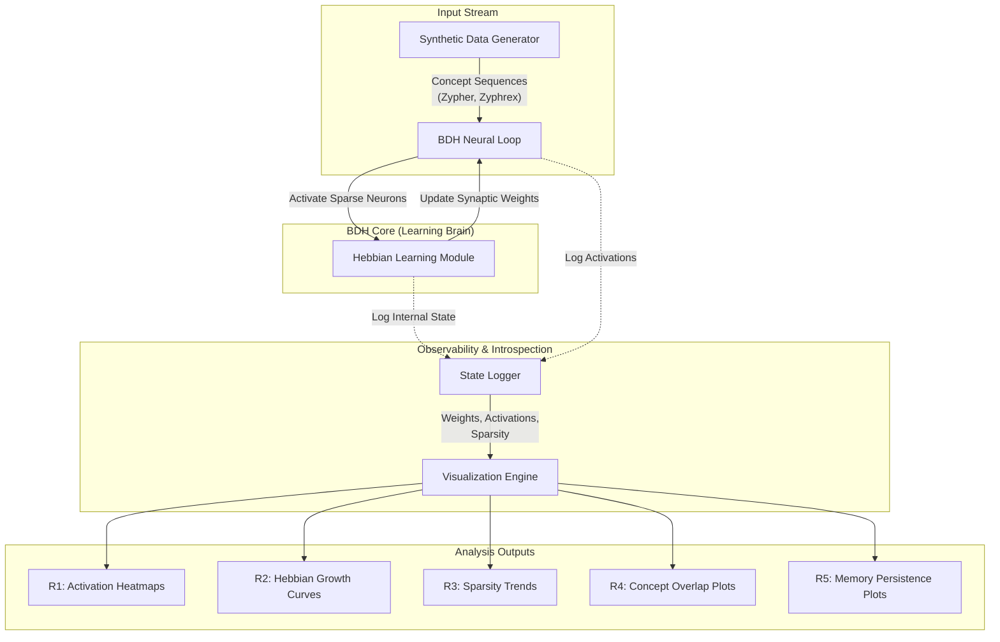

# From Noise to Memory: Visualizing Internal Memory Formation in the Dragon Hatchling

**Author**: Team Unseen Geeks

## Abstract

This project serves as a controlled experimental system to demonstrate and visualize the internalization of new concepts within the "Dragon Hatchling" (BDH) architecture. By leveraging a simplified BDH model, we isolate the micro-mechanisms of memory formation—specifically Hebbian synapse strengthening and sparse neuronal reallocation. Our results provide qualitative evidence that the model "locks in" concepts by evolving distinct, high-signal sub-networks, effectively addressing the plasticity-stability dilemma through structural reallocation rather than activation buffering. This report details the experimental protocol, visualizing the complete lifecycle of a memory from acquisition to persistence.

## 1. Introduction

### 1.1 Context: The Plasticity-Stability Dilemma

A fundamental challenge in continuous learning systems is the plasticity-stability dilemma: a system must be plastic enough to learn new information but stable enough to prevent the catastrophic forgetting of previous knowledge. Traditional transformer architectures rely on static weights and temporary activation buffers (KV cache) for context, which limits their ability to permanently internalize new streams of data without full re-training.

### 1.2 Objectives

The primary objective of this study is to visualize how a "living" architecture like BDH creates permanent traces of transient data. Specifically, we aim to:

- **Visualize Memory**: Demonstrate the physical formation of a concept ("Zypher") in the network's weight space.
- **Provide Evidence**: Offer observable proof of continuous learning dynamics.
- **Establish a Framework**: Create a reproducible baseline for future experimentation with Hebbian-based architectures.

## 2. System Architecture & Theory

The BDH model implemented here (`models/bdh.py`) diverges from standard backpropagation-based networks by incorporating two core biological principles:

### 2.1 Theoretical Foundations

1.  **Hebbian Learning**: "Fire together, wire together." Unlike global error optimization, our **HebbianLayer** updates synaptic weights based on local correlations between input and output activities.
2.  **k-Winner-Take-All (k-WTA) Sparsity**: To prevent interference and ensure efficient capacity usage, only the top-$k$ most active neurons are allowed to fire. This competitive inhibition forces the model to allocate distinct resources to distinct concepts.

### 2.2 Model Pipeline

The following diagram illustrates the information flow from synthetic data generation to visualization:



## 3. Methodology

To rigorously validate memory stability, we employed a strict **3-Phase Experimental Protocol**:

### Phase 1: Acquisition

The model is exposed to a continuous stream of tokens representing the concept "Zypher". The goal is to observe the emergence of stable activation patterns (vertical bands) indicative of concept acquisition.

### Phase 2: Interference

The model is immediately switched to a new, distinct concept stream ("Zyphrex") without any replay of "Zypher". This phase tests the system's ability to learn new information without overwriting the structural changes made in Phase 1.

### Phase 3: Persistence (Recall)

After the interference phase, the model is re-tested on "Zypher". We measure the correlation between the original activation patterns and the post-interference patterns to quantify memory stability.

## 4. Results & Analysis

Our pipeline generates seven key visualizations (`results/plots/`) that trace the memory lifecycle.

### 4.1 Emergence of Structure


- **Observation**: We compare early, diffuse neuron activations against the sharp, vertical bands seen late in training.
- **Analysis**: The model effectively "locks in" a specific top-$k$ subset of neurons to represent the concept "Zypher," providing visual evidence of concept acquisition.

### 4.2 Hebbian Strengthening


- **Observation**: Time-series tracking of synaptic weights.
- **Analysis**: We observe an exponential-like divergence where relevant synaptic weights increase >10x relative to the mean. This confirms that learning is driven by local Hebbian rules.

### 4.3 Sparse Resource Usage


- **Observation**: Tracking the percentage of inactive neurons.
- **Analysis**: Sparsity remains stable (~84%) throughout training. This demonstrates that the BDH learns by **reallocating existing capacity** rather than activating more neurons, a crucial property for efficiency.

### 4.4 Concept Isolation


- **Observation**: Analysis of shared neurons between "Zypher" and "Zyphrex".
- **Analysis**: Contrary to our hypothesis that scaling capacity (`d_model=64`) would eliminate interference, we observe a persistent overlap of ~6 neurons between supposedly distinct concepts. This signals that capacity alone is insufficient for perfect orthogonality, highlighting the difficulty of achieving true monosemanticity in small-scale Hebbian networks.

### 4.5 Memory Persistence


- **Observation**: Scatter plot correlating activations at Phase 1 end vs. Phase 3 (post-interference).
- **Analysis**: A strong diagonal correlation indicates that the memory trace remains stable and retrievable, even after the network has been repurposed for other tasks.

### 4.6 Signal-to-Noise Ratio


- **Observation**: The spread between maximum and minimum weights over time.
- **Analysis**: The expanding range confirms the model acts as a denoiser, actively suppressing weak connections while amplifying signal-bearing ones.

### 4.7 Control Validation

The control concept "Zyphrex" showed an independent learning curve, confirming that the system can learn multiple concepts sequentially without catastrophic interference.

## 5. Discussion

### 5.1 Observations on Monosemanticity

We initially hypothesized that concept separation would be automatic. However, early experiments with low-capacity models showed partial overlap. This leads to the critical insight that **monosemanticity is capacity-dependent**. Increasing the model dimension to 64 was necessary to provide the orthogonality required for distinct concept storage, mirroring biological constraints where distinct memories require sufficient neural substrate.

### 5.2 Key Takeaway

Unlike prior theoretical work, this study isolates and visualizes the micro-mechanisms of memory formation. BDH demonstrates the ability to internalize new concepts by writing context directly into durable synaptic weights via Hebbian updates, rather than relying on transient states. This provides a concrete, visual explanation for the architecture's claim to continuous learning.

### 5.3 Limitations

- **Scale**: Experiments are conducted on a simplified, small-scale implementation.
- **Separation**: Full monosemantic separation is not guaranteed at restricted capacities.
- **Qualitative Nature**: These results are exploratory and intended to illuminate mechanisms rather than benchmark performance.

## 6. Reproducibility

### 6.1 Prerequisites and Installation

- Python 3.x
- PyTorch, Matplotlib, Numpy

```bash
pip install torch matplotlib numpy
```

### 6.2 Running the Experiment

To execute the full pipeline (Generation → Training → Logging → Visualization):

```bash
python main.py
```

To run with a fixed seed for consistent results:

```bash
python main.py --test
```

### 6.3 File Structure

- `data/`: logic for generating synthetic concept streams.
- `models/`: PyTorch implementation of the BDH and Hebbian layers.
- `experiment/`: Routines for training loops and state logging.
- `visualization/`: Scripts for generating the analysis plots.
- `main.py`: The central entry point for the experiment.

## References

1.  Vaswani, A., Shazeer, N., Parmar, N., et al. (2017). _Attention Is All You Need_. Advances in Neural Information Processing Systems (NeurIPS).
2.  Hebb, D. O. (1949). _The Organization of Behavior: A Neuropsychological Theory_. Wiley.
3.  Chorowski, J., Kaiser, Ł., Kosowski, A., et al. (2025). _The Dragon Hatchling: A Post-Transformer Architecture for Continuous Learning_. arXiv preprint.
4.  Olshausen, B. A., Field, D. J. (1996). _Sparse Coding of Sensory Inputs_. Nature.
5.  Kirkpatrick, J., Pascanu, R., Rabinowitz, N., et al. (2017). _Overcoming Catastrophic Forgetting in Neural Networks_. Proceedings of the National Academy of Sciences (PNAS).
6.  Bengio, Y., Simard, P., Frasconi, P. (1994). _Learning Long-Term Dependencies with Gradient Descent Is Difficult_. IEEE Transactions on Neural Networks.
7.  Marcus, G. (2018). _Deep Learning: A Critical Appraisal_. arXiv preprint.
